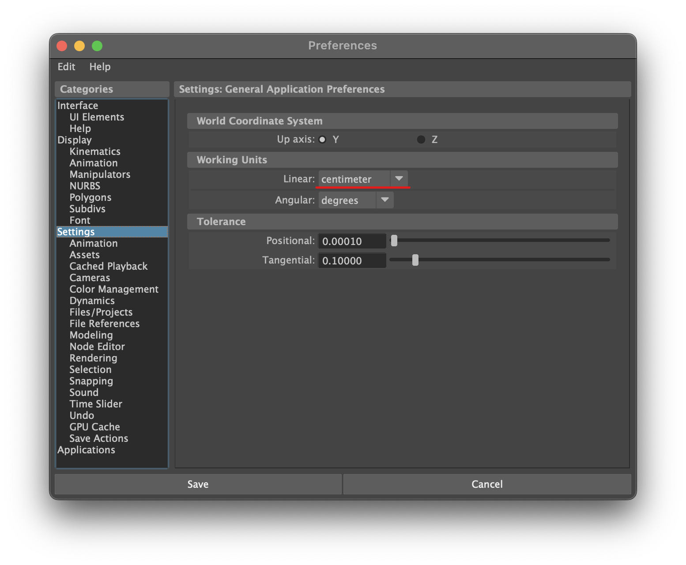
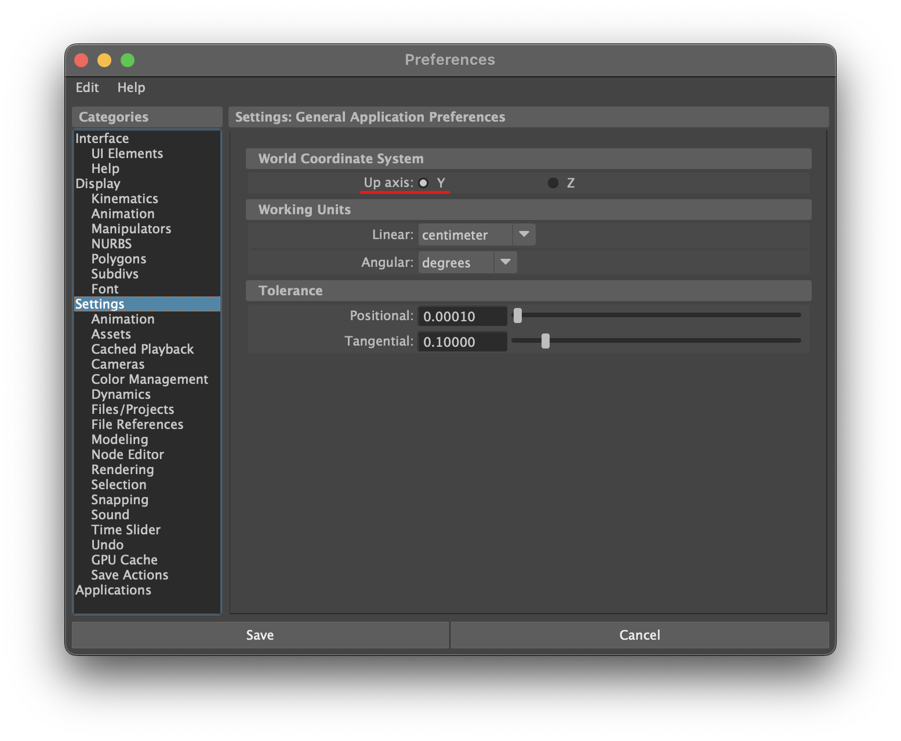
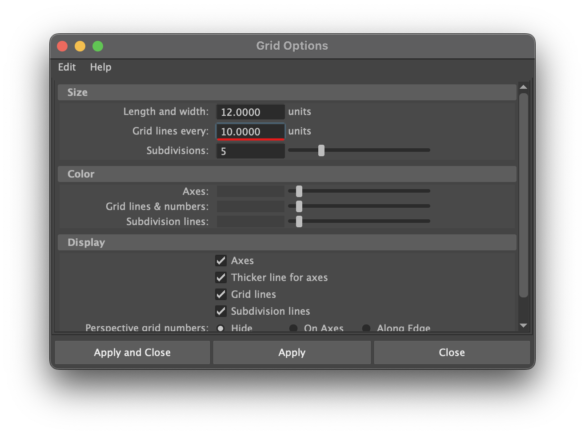

# シーン設定（Unreal Engine）

:::info このページについて

- **ページ更新時期** : このページは**2024年8月**に執筆しています。現状と内容が異なる場合があります。
- **バージョン** : このページはMaya 2024.2の情報が記載されています。
- **情報出展元** : [**公式のヘルプページ**](https://help.autodesk.com/view/MAYAUL/2024/ENU/?guid=GUID-DAB74E5F-58D2-49E7-B919-BED413F44FDE)を参考に記載しています。具体的な参照ページが存在する場合は適宜リンクを記載します。
:::

## Unreal Engine用にアセットを作成する

Unreal Engine向けにMayaでアセットを制作する際のシーン設定について説明します。

:::warning プロジェクトで設定を共有する

このページでは、Mayaの設定を変更する説明も行いますが、複数人で作業を行う場合は**必ずメンバー全員で統一**します。  
作業者ごとに作業環境が異なると、アセットに意図しない更新をしてしまう場合があります。  

例えば、距離単位を変更する場合を想定します。  
Aさんがメートル単位でモデルを制作したのち、Bさんがモデルの修正をしようとセンチメートル単位のシーンで作業して変更内容を保存します。  
そうすると、Unreal Engineに読み込んだときに意図しない大きさで出力されてしまいます。  

Mayaの起動時に設定を自動で行うスクリプトを組んだり、エクスポートするときにチェックするツールを作成したりすることで、[**ヒューマンエラー**](https://kotobank.jp/word/%E3%83%92%E3%83%A5%E3%83%BC%E3%83%9E%E3%83%B3%E3%83%BB%E3%82%A8%E3%83%A9%E3%83%BC-1125719)を回避するようにしましょう。
:::

## 1️⃣ シーン単位の設定

Unreal Engine 5の距離単位は**センチメートル**です。  
そのため、Mayaの作業単位がセンチメートルになっていることを確認してから作業を行います。  
これによって、Mayaで作成したアセットがUE5に正確なスケールでインポートできます。  

### 確認方法

1. Mayaの上部メニューから Window > Settings/Preferences > **Preferences** を開く
2. Settings タブで、 Working Units の Linear が**centimeter**になっていることを確認



### コマンドで設定する場合

```python title="change_working_unit"
cmds.optionVar(sv=["workingUnitLinearDefault", "cm"])
```

[**optionVer command**](https://help.autodesk.com/cloudhelp/2024/ENU/Maya-Tech-Docs/CommandsPython/optionVar.html)

## 2️⃣ ワールド軸の設定

Mayaのデフォルトのアップ軸は**Y**ですが、Unreal Engineのアップ軸は**Z**です。  
そのため、  

- アップ軸をYのままで作業し、エクスポート時にアップ軸がZになるように軸変換を行う
- 最初からZアップ軸で作業する

のいずれかを選択する必要があります。  
Zアップ軸で作業する場合は、以下の手順を参考にします。  

### 設定方法

1. Window > Settings/Preferences > Preferences で Settings タブを開く
2. World Coordinate System の Up Axis を **Z** に設定



### コマンドで設定する場合

```python title="change_up_axis"
cmds.upAxis(axis='y', rotateView=True)
```

[**upAxis command**](https://help.autodesk.com/cloudhelp/2025/ENU/Maya-Tech-Docs/CommandsPython/upAxis.html)

## 3️⃣ グリッド設定

正確なモデリングを行うために、Mayaのグリッド設定をUnreal Engine 5に合わせて調整します。  
フォトリアルな作品などアセットのスケールが重要な場合、グリッドサイズを最適化することで、正確な寸法で作業を進めることができます。  

### 設定方法

1. Display > **Grid Options** を開く
2. Size の Grid lines every を **10.0000** に設定


```python title="change_grid_spacing"
cmds.grid(spacing=10)
```

[**grid command**](https://help.autodesk.com/cloudhelp/2025/ENU/Maya-Tech-Docs/CommandsPython/grid.html)
