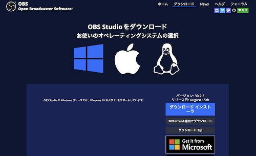

# インストール方法

:::warning 編集中
このページは現在編集中です。
:::

:::info このページについて
- **ページ更新時期** : このページは**2024年8月**に執筆しています。現状と内容が異なる場合があります。
- **対象OS** : このページは**Windows**を使用した方法で記入します。添付画像もWindowsの表示です。
- **情報出展元** : [**公式のナレッジベース**](https://obsproject.com/kb/)を参考に記載しています。具体的な参照ページが存在する場合は適宜リンクを記載します。
:::

## 1️⃣ ダウンロード

| 画像 | 説明 |
| --- | --- |
|  | [**コチラ**](https://obsproject.com/ja/download)を**クリック**して、公式のダウンロードページにアクセスします。   左のようなページが表示されれば大丈夫です。     画面中央のWindowsのマークが青色になっていない場合、別OS（MacやLinux）の項目が表示されています。  Windowsのマークをクリックし、青色になっていることを確認してから次の手順に進みます。|
| |ページ右側に表示されている「ダウンロードインストーラー」を**クリック**してダウンロードします。|
|||

## 2️⃣ インストール
