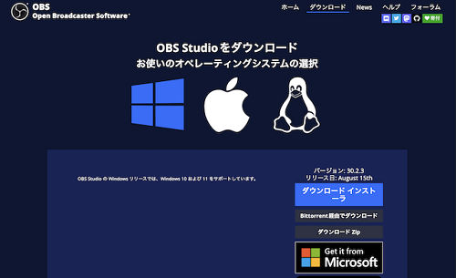
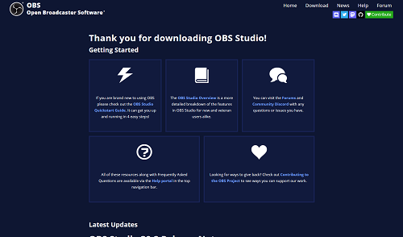
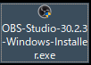
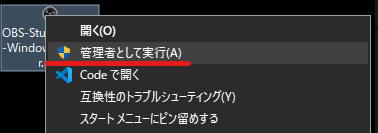
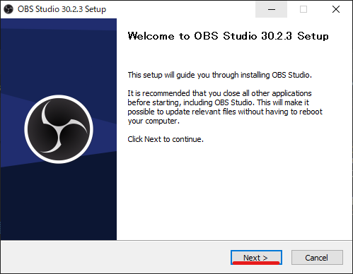
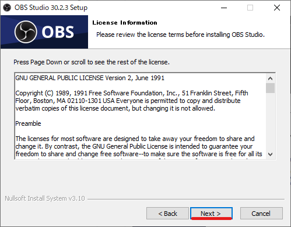
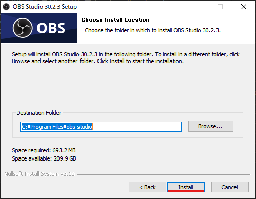
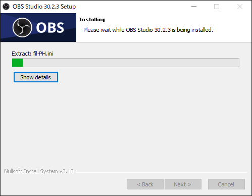
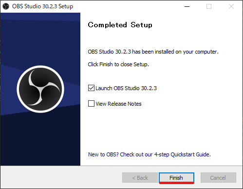
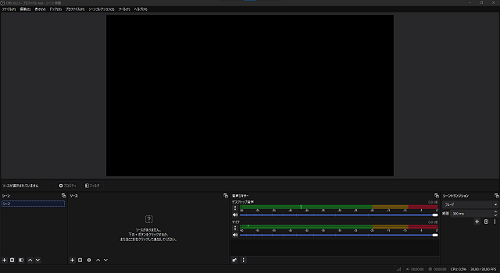

# インストール方法

このページでは、インストール方法について解説します。

:::info このページについて

- **ページ更新時期** : このページは**2024年8月**に執筆しています。現状と内容が異なる場合があります。
- **対象OS** : このページは**Windows**を使用した方法で記入します。添付画像もWindowsの表示です。
- **情報出展元** : [**公式のナレッジベース**](https://obsproject.com/kb/)を参考に記載しています。具体的な参照ページが存在する場合は適宜リンクを記載します。
:::

***

## 1️⃣ ダウンロード

| 画像 | 説明 |
| --- | --- |
|  | [**コチラ**](https://obsproject.com/ja/download)をクリックして、公式のダウンロードページにアクセスします。   左のようなページが表示されれば大丈夫です。     画面中央のWindowsのマークが青色になっていない場合、別OS（MacやLinux）の項目が表示されています。  Windowsのマークをクリックし、青色になっていることを確認してから次の手順に進みます。|
| |ページ右側に表示されている「ダウンロードインストーラー」を**クリック**してダウンロードします。|
||左のような画面が表示されたらダウンロードが開始されています。  このページは使わないので閉じます。|

## 2️⃣ インストール

| 画像 | 説明 |
| :---: | --- |
||ダウンロードが完了すると左のようなファイルがダウンロード先に保存されています。  |
||アイコンを右クリックし「**管理者として実行**」をクリックします。    「このアプリがデバイスに変更を加えることを許可しますか？」という画面が表示されたら「**はい**」をクリックします。|
||左のような画面が表示されたら「**Next>**」をクリックします。|
||「**Next>**」をクリックします。|
||「**Install**」をクリックします。    インストール場所を変更することができますが、よほどの理由がない限り初期設定のまま変更しないでください。  理由は、不具合が発生したときに解決が難しくなるためです。  どのような不具合が発生しても自分自身で解決できる人のみ、変更しても問題ありません。|
||インストールが完了するまでしばらく待ちます。|
||インストールが完了すると左のような画面が表示されます。  「**Finish**」をクリックします。|
||左の画像はOBS Studioを初めて起動したときのものです。  この画面が表示されたらインストールは正常に完了しています。    お疲れさまでした！|
