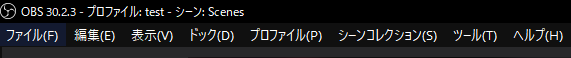
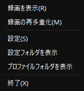

# メニュー解説

このページではOBS Studioのメニューについて解説します。  
メニューは画面の上部に表示されています。

:::info このページについて

- **ページ更新時期** : このページは**2024年8月**に執筆しています。現状と内容が異なる場合があります。
- **対象OS** : このページは**Windows**を使用した方法で記入します。添付画像もWindowsの表示です。
- **OBS Studioのバージョン** : このページは**OBS Studio 30.2.3 64bit**の情報が記載されています。
:::

***

## ファイル

この項目では「ファイル」メニューについて解説します。

|項目名|説明|
|:---:|---|
|**録画を表示**|OBS Studioで録画したファイルを保存しているフォルダが、エクスプローラーで開きます。  録画ファイルの保存先は「ファイル」→「設定」→「出力」→「録画」→「録画ファイルのパス」空変更できます。|
|**録画の再多重化**||
|**設定**|設定画面を開きます。  OBS Studioの各種設定が行えます。|
|**設定フォルダを表示**|OBS Studioの各種設定ファイルの保存されているフォルダが、エクスプローラーで開きます。  フォルダ内には[**ログファイル**](/docs/obs_studio/trouble_shooting/log_file.md)も保存されています。|
