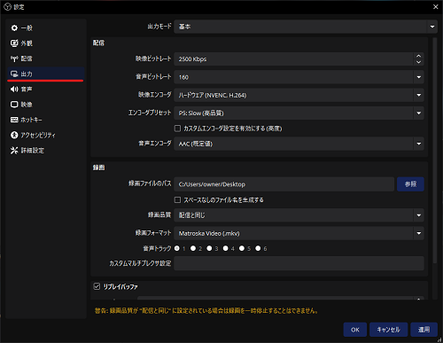
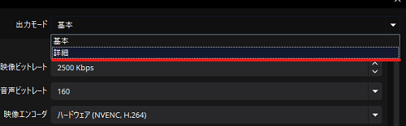
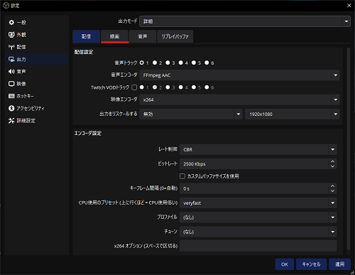
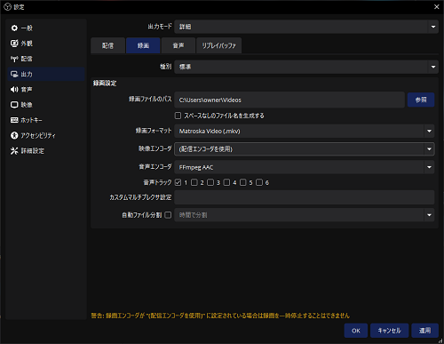
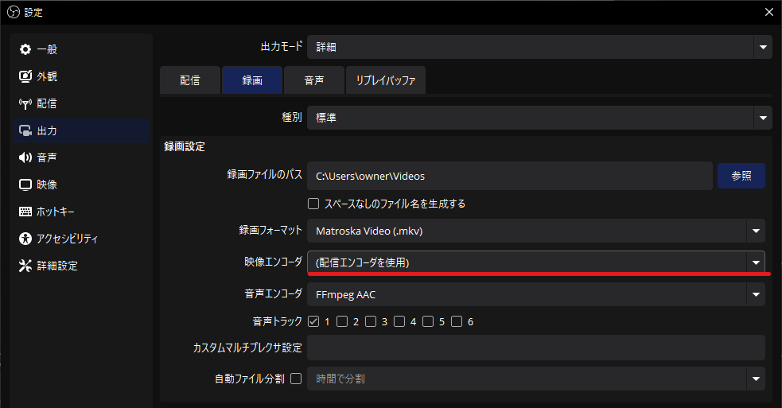

# 推奨される録画の設定

このページでは、OBS Studio公式から推奨される録画の設定に関して解説します。

:::info このページについて

- **ページ更新時期** : このページは**2024年8月**に執筆しています。現状と内容が異なる場合があります。
- **OBS Studioのバージョン** : このページは**OBS Studio 30.2.3 64bit**の情報が記載されています。
- **情報出展元** : 公式のナレッジベース[**Advanced Recording Settings Guide**](https://obsproject.com/kb/advanced-recording-settings-guide)を参考に記載しています。具体的な参照ページが存在する場合は適宜リンクを記載します。
:::

公式からは一般的に出力モードを「基本」に設定することが使いやすいために推奨されています。  
出力モードを「詳細」に設定することで「基本」では設定できなかった細かい部分を調整することができるようになります。  

  	
録画設定の表示方法はコチラ

	|画像|説明|
	|:---:|---|
	||まずは設定画面を表示します。  設定画面の開き方が分からない人は[**コチラ**](/docs/obs_studio/settings/how_to_start.md)を確認します。|
	||左の項目から「**出力**」を選択します。|
	||画面上部の「出力モード」から「**詳細**」を選択します。  |
	||項目が左の画像のように変更されたことを確認します。  現在「配信」の項目が開かれているので、上部のタブから「**録画**」をクリックします。|
	||左のような画面が表示されていれば成功です。|

***

## エンコーダーを設定

映像のエンコーダーごとに推奨される設定値が異なります。  
映像エンコーダーとは、撮影した映像を「.mp4」や「.mov」といった動画形式にするソフトウェアです。  

設定は以下の場所にあります。

  

    

		メニューをクリックするといくつか項目が出てくるかと思いますが、使っているパソコンの部品によって表示される項目が違います。  

		著者のおすすめは「**NVENC(HEVC か H.264)**」もしくは「**AMD**」を使用した[**GPU**](https://www.ntt.com/business/sdpf/knowledge/archive_05.html)での録画です。  
		「x264」や「Quicksync」といった[**CPU**](https://www.mouse-jp.co.jp/store/bto_customize/cpu.aspx)をつかった録画は負荷が大きくなりやすいためあまり使用しません。  
		GPUをつかった録画で映像に乱れが出てしまう場合の代替案として使ったりします。

    

    

	

## 録画項目を設定

以下はOBS Studio公式が推奨している設定値です。  
設定した「映像エンコーダー」によって設定値が変わります。  
自分の選んだ映像エンコーダーの項目を参照してください。

  

    

	記載がなかった項目は、デフォルトの設定値を記載します。  
	デフォルト設定値を記載した項目には、説明欄に「デフォルト設定」と同時に記載します。

	また、「AMD」と「Quicksync」に関しては、著者の環境に存在しません。  
	デフォルト設定の記載などもしておりませんので、ご了承ください。
    

    

	

### NVENC（HEVC もしくは H.264）

| 項目名 | 設定 | 説明 |
|:--:|---|---|
| **レート制御** | CQP | |
| **CQレベル** | 16 ～ 23 | CQレベルを低くすると、画質が上がり、ファイルサイズが大きくなります |
| **キーフレーム間隔** | 2 ||
| **プリセット** | P5:Slow（高品質）||
| **チューニング** | 高品質 ||
| **マルチパスモード** | 2パス（1/4解像度） ||
| **プロファイル** | high |デフォルト設定|
| **Look-ahead** | オフ ||
| **心理視覚チューニング** | オン ||
| **GPU** | 0 |デフォルト設定|
| **最大Bフレーム** | 2 ||

### x264

| 項目名 | 設定 | 説明 |
|:--:|---|---|
| **レート制御** | CRF ||
| **CRF** | 16 ～ 23 | CRFを低くすると、画質が上がり、ファイルサイズが大きくなります|
| **キーフレーム間隔** | 2 ||
| **CPU使用プリセット** | veryfast ||
| **プロファイル** | high ||
| **チューン** | （なし） ||
|**x264オプション**|　|デフォルト設定（空欄です）|

### AMD

| 項目名 | 設定 | 説明 |
|:--:|---|---|
| **レート制御** | CQP ||
| **CQレベル** | 16-23| CQレベルを低くすると、画質が上がり、ファイルサイズが大きくなります|
| **キーフレーム間隔** | 2 ||
| **プリセット** | quality ||
| **プロファイル** | high ||
| **最大Bフレーム数** | 0 ||

### Quicksync

| 項目名 | 設定 | 説明 |
|:--:|---|---|
| **レート制御** | ICQ ||
| **ICQ品質** | 16-23|ICQ品質を低くすると、品質が向上し、ファイルサイズが大きくなります |
| **ターゲット使用** | TU4 ||
| **プロファイル** | High ||
| **キーフレーム間隔** | 2 ||
| **レイテンシ** | normal ||
| **Bフレーム数** | 3 ||
