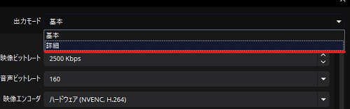

# 配信設定：公式推奨の設定

このページでは、OBS Studio公式から推奨される配信の設定に関して解説します。

:::info このページについて

- **ページ更新時期** : このページは**2024年8月**に執筆しています。現状と内容が異なる場合があります。
- **OBS Studioのバージョン** : このページは**OBS Studio 30.2.3 64bit**の情報が記載されています。
- **対象OS** : このページは**Windows**を使用した方法で記入します。添付画像もWindowsの表示です。
- **情報出展元** : 各種配信プラットフォーム、およびNVIDIAの公式ヘルプページを参照しています。具体的な参照ページが存在する場合は適宜リンクを記載します。
:::

  	
配信設定の表示方法はコチラ

	|画像|説明|
	|:---:|---|
	||まずは設定画面を表示します。  設定画面の開き方が分からない人は[**コチラ**](/docs/obs_studio/settings/how_to_start.md)を確認します。|
	||左の項目から「**出力**」を選択します。|
	||画面上部の「出力モード」から「**詳細**」を選択します。  |
	||左のような画面が表示されていれば成功です。|

***

## Youtube

### 推奨設定

この項目では、Youtube、およびNVIDIA公式が推奨している配信設定を記載します。  
以下は映像エンコーダーに「**H.264**」解像度を「**1920x1080**」フレームレートが「**60fps**」における推奨設定です。  
参考にしたページは[**コチラ**](/docs/obs_studio/recommended_setting/streaming#参考ページ)に記載しています。

#### 配信設定

|項目|設定値|補足|
|:---:|---|---|
|**音声トラック**|1|公式から特に指定はありません。  デフォルト設定です。  専用に設定していない場合、このままで大丈夫です。|
|**音声エンコーダ**|FFmpeg AAC|Youtube推奨|
|**Twitch VODトラック**|オフ|Youtubeで配信する場合、使用しません。|
|**映像エンコーダ**|・NVIDIA NVENC H.264  ・NVIDIA NVENC HEVC  ・AV1|Youtube推奨  いずれかを選択してください。  最も軽量なエンコーダは「H.264」です。  「HEVC」は「H.264」の後継で、圧縮率が高く高画質ですがGPUの負荷が高いです。  「AV1」は「HEVC」よりもさらに圧縮率が高いですが、より一層負荷が高くなります。|
|**出力をリスケールする**|無効|キャプチャーした映像を指定した解像度に圧縮します。  映像を圧縮して解像度を下げるため、理由がなければ設定は不要です。|

  

    

		映像エンコーダーですが、NVIDIA公式によると、  
		
		・RTX40○○のGPUを搭載している場合：　「**NVENC**」か「**AV1**」  
		・違う場合：　「**NVENC**」か「**HEVC**」  
		
		これらのエンコーダーを選択するように書いてあります。  
    

    

	

#### エンコーダー設定

|項目|設定値|補足|
|:---:|---|---|
|**レート制御**|CBR|Youtube推奨|
|**ビットレート**|12000 Kbps|Youtube推奨  回線速度に応じ、下限3000kbpsまでの間で調整してください。|
|**キーフレーム間隔**|2s|Youtube推奨|
|**プリセット**|P6: Slower (より高品質)|NVIDIA推奨。  映像品質に関わって来ますが、「P5:Slow(高品質)」を超えた設定にするとPC負荷がかなり高くなります。  PCスペックに応じて増減させてください。|
|**チューニング**|高品質|公式から特に指定はありません。  映像品質に関わる設定です。  品質を上げるとPCへの負荷が高くなります。  PCスペックに応じて増減させてください。|
|**マルチパスモード**|2パス(1/4解像度)|公式から特に指定はありません。  映像品質に関わる設定です。  「2パス(1/4解像度)」がPC負荷と画質のバランスが取れた設定です。  PCスペックに応じて増減させてください。|
|**プロファイル**|high|公式から特に指定はありません。  映像品質に関わる設定です。  PCスペックに応じて増減させてください。|
|**Look-ahead**|オン|NVIDIA推奨  同様にNVIDIAから[**映像の動きが大きい場合画質が低下する**](https://www.nvidia.com/en-us/geforce/guides/broadcasting-guide/)と記述があります。  配信する映像で激しい動きがある場合はオフにします。|
|**心理視覚チューニング**|オン|NVIDIA推奨  エンコーダーのレート歪みが最適化され、加えてビットレートの使用方法が大幅に最適化されます。  動きのある映像の画質が向上します。|
|**GPU**|0|パソコンで使用されているGPUの番号を指定します。  複数のGPUがパソコンに搭載されている場合は、使用したいGPUの番号を設定して下さい。|
|**最大Bフレーム**|2(*4)|NVIDIA推奨  「Look-ahead」の項目を「オン」にしている場合は「**4**」を設定します。  そうでない場合は「**2**」を設定します。|

  	
各解像度・フレームレートごとの推奨ビットレートはコチラ

| 解像度 @フレームレート | 推奨ビットレート（H.264） |
|:--:|:--:|
| **4K / 2160p @60fps** | 35,000 Kbps |
| **4K / 2160p @30fps** | 30,000 Kbps |
| **1440p @60fps** | 24,000 Kbps |
| **1440p @30fps** | 15,000 Kbps |
| **1080p @60fps** | 12,000 Kbps |
| **1080p @30fps** | 10,000 Kbps |
| **720p @60fps** | 6,000 Kbps |
| **240p ～ 720p @30fps** | 4,000 Kbps |

#### 参考ページ
- [**Youtube - Choose live encoder settings, bitrates, and resolutions**](https://support.google.com/youtube/answer/2853702?hl=en)
- [**NVIDIA NVENC OBS Guide**](https://www.nvidia.com/en-us/geforce/guides/broadcasting-guide/)