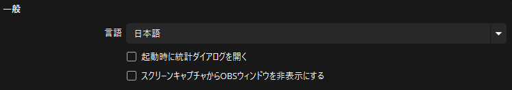

# 設定 : 一般

このページでは「一般」項目の設定について解説します。

:::warning 編集中
このページは編集中です。
:::

:::info このページについて

- **ページ更新時期** : このページは**2024年8月**に執筆しています。現状と内容が異なる場合があります。
:::

## 一般

全体の動作に関係する項目を設定します。  
以下の項目が該当します。

|項目名|説明|
|:---:|:---|
|言語|OBS Studioのメニューで使用される言語を設定します。  「日本語」に設定すると、メニューがすべて日本語で表示されるようになります。    OBS Studio公式ではなく、第三者が作成したプラグインなどを入れた場合、この言語設定が反映されない場合があります。|
|起動時に統計ダイアログを開く|チェックを入れると、起動時に以下のようなウィンドウが表示されるようになります。  |

### スクリーンキャプチャからOBSウィンドウを非表示にする

チェックを入れると、Zoomなどの画面共有ができる機能にOBS Studioが映らなくなります。