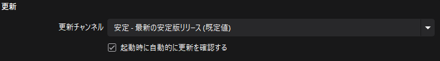
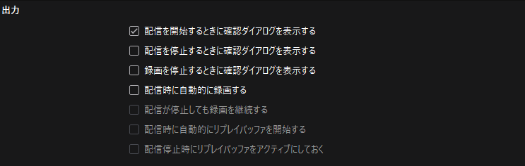
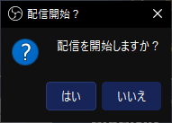
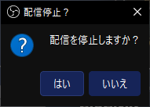
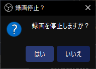

# 設定 : 一般

このページでは「一般」項目の設定について解説します。  
設定画面の開き方は[**コチラ**](/docs/obs_studio/settings/how_to_start.md)を確認します。

:::warning 編集中
このページは編集中です。
:::

:::info このページについて

- **ページ更新時期** : このページは**2024年8月**に執筆しています。現状と内容が異なる場合があります。
- **OBS Studioのバージョン** : このページは**OBS Studio 30.2.3 64bit**の情報が記載されています。
:::

## 一般

全体の動作に関係する項目を設定します。  

|項目名|説明|
|:---:|---|
|**言語**|OBS Studioのメニューで使用される言語を設定します。  「日本語」に設定すると、メニューがすべて日本語で表示されるようになります。    OBS Studio公式ではなく、第三者が作成したプラグインなどを入れた場合、この言語設定が反映されない場合があります。|
|**起動時に統計ダイアログを開く**|チェックを入れると、起動時に以下のようなウィンドウが表示されるようになります。  |
|**スクリーンキャプチャからOBSウィンドウを非表示にする**|チェックを入れると、スクリーンショットや、Zoomなどの画面共有ができる機能にOBS Studioが映らなくなります。|

## 更新

OBS Studioのバージョンアップに関する設定をします。

|項目名|説明|
|:---:|---|
|**更新チャンネル**|OBS Studioの更新を行うとき、  ・ バグなどの比較的少ない、安定したバージョン  ・ 最新の機能などが搭載されている比較的不安定なバージョン  のどちらかを選択できます。    明確な理由などがなければ「**安定-最新の安定リリース（規定値）**」のままにしておきます。|
|**起動時に自動的に更新を確認する**|チェックが入っていると、OBS Studioを起動したときに新しいバージョンが存在するか確認します。  存在する場合はアップデートを行うかの確認画面が開きます。|

## 出力

録画・配信時の設定をします。

|項目名|説明|
|:---:|---|
|**配信を開始するときに確認ダイアログを表示する**|配信を開始するとき、以下のような確認画面が表示されます。  |
|**配信を停止するときに確認ダイアログを表示する**|配信を停止するとき、以下のような確認画面が表示されます。  |
|**録画を停止するときに確認ダイアログを表示する**|録画を停止するとき、以下のような確認画面が表示されます。  |
|**配信時に自動的に録画する**|配信開始と同時に、録画機能も同時に開始されます。  配信が停止するのと同時に録画も停止します。|
|**配信時が停止しても録画を継続する**|配信停止をしても、録画機能が停止しなくなります。  「配信時に自動的に録画する」にチェックが入っていると選択できるようになります。|
|**配信時に自動的にリプレイバッファを開始する**|配信を開始したときに、リプレイバッファが同時に開始されます。  リプレイバッファとは、設定した時間分の映像をさかのぼって保存できる機能です。  この機能を有効にするには、「設定」→「出力」→「リプレイバッファ」が有効になっている必要があります。|
|**配信停止時にリプレイバッファをアクティブにしておく**|配信停止をしても、リプレイバッファが停止しなくなります。  この機能を有効にするには、「設定」→「出力」→「リプレイバッファ」が有効になっている、かつ「配信時に自動的にリプレイバッファを開始する」が有効になっている必要があります。|
