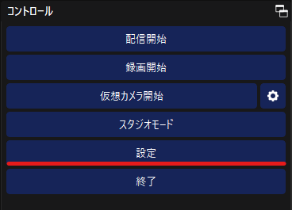
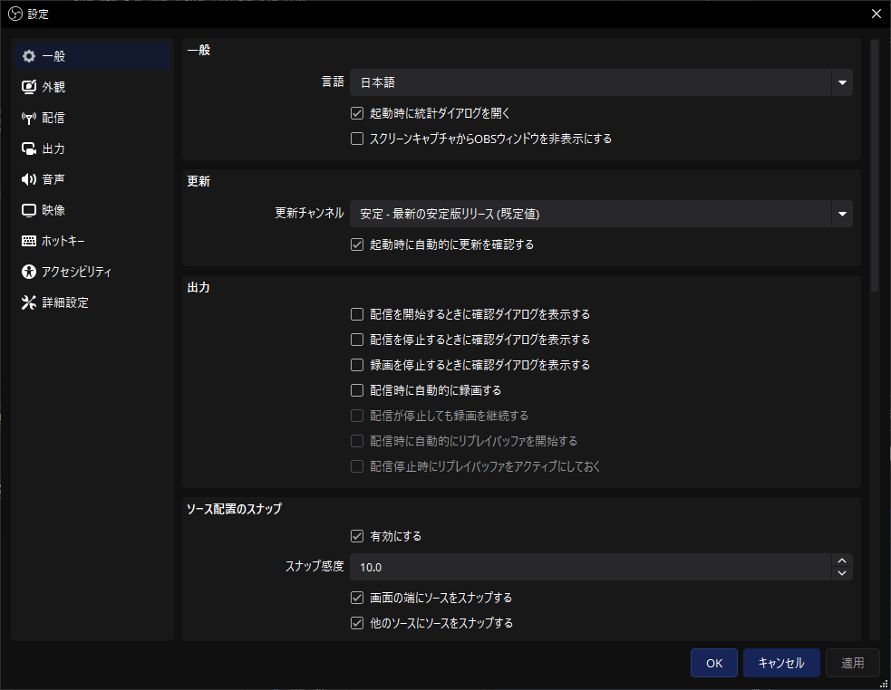
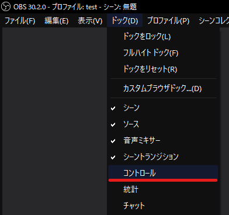

# 設定の開き方

このページでは「設定」ウィンドウの開き方について解説します。

:::info このページについて

- **ページ更新時期** : このページは**2024年8月**に執筆しています。現状と内容が異なる場合があります。
- **対象OS** : このページは**Windows**を使用した方法で記入します。添付画像もWindowsの表示です。
- **情報出展元** : [**公式のナレッジベース**](https://obsproject.com/kb/)を参考に記載しています。具体的な参照ページが存在する場合は適宜リンクを記載します。
:::

|画像|説明|
|:---:|:---|
||OBS Studioのウィンドウ右下にある「コントロール」パネルから「**設定**」ボタンをクリックします。|
||左のような画面が表示されれば成功です。|

  	
「コントロール」パネルが表示されていない場合

	「コントロール」パネルが存在しない場合、ウィンドウ上部のメニュー、「ドック」→「**コントロール**」にチェックが入っていることを確認します。  チェックが入っていないとウィンドウに表示されません。  
	

	それでも表示されない場合、パネルがOBS Studioウィンドウの外に表示されてしまっている場合や、ソフトウェア自体の不具合が考えられます。  
	以下の方法を上から順番に試して表示されるか確認してください。  
	1. **パネルを探す** : OBS Studioウィンドウの外に「コントロール」パネルが独立して存在していないか確認します。
	2. **ソフトウェアの再起動** : 一度ウィンドウを閉じ、再びOBS Studioを起動します。
	3. **PCの再起動** : パソコンを再起動し、再びOBS Studioを起動します。
	4. **再インストール** : 一度OBS Studioをアンインストールし、再度インストールを行います。

