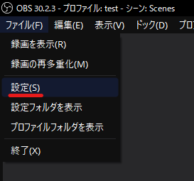

# 設定の開き方

このページでは「設定」ウィンドウの開き方について解説します。

:::info このページについて

- **ページ更新時期** : このページは**2024年8月**に執筆しています。現状と内容が異なる場合があります。
- **OBS Studioのバージョン** : このページは**OBS Studio 30.2.3 64bit**の情報が記載されています。
:::

***

|画像|説明|
|:---:|:---|
||OBS Studioの上部にあるメニューバーから「ファイル」→「**設定**」をクリックします。|
||左のような画面が表示されれば成功です。|
