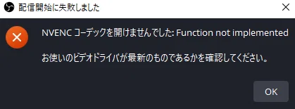
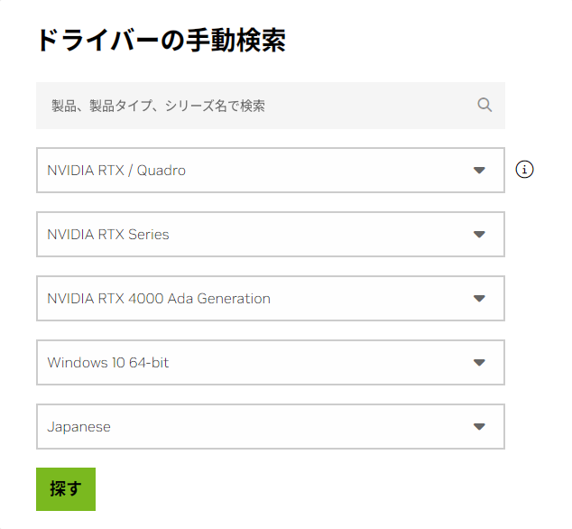
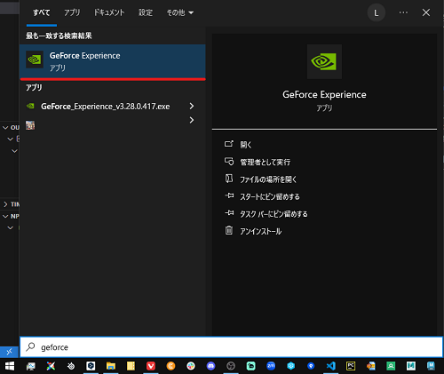
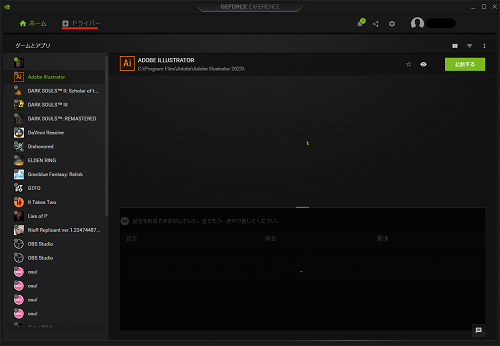
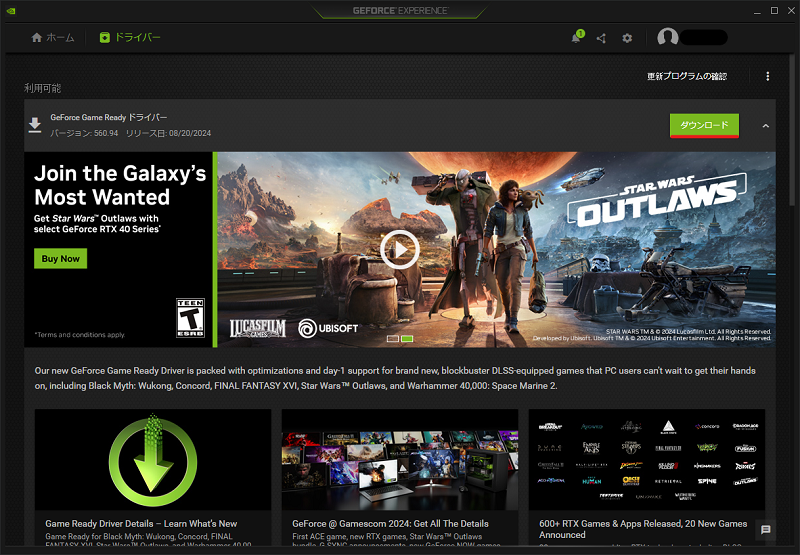
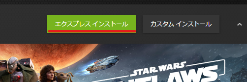
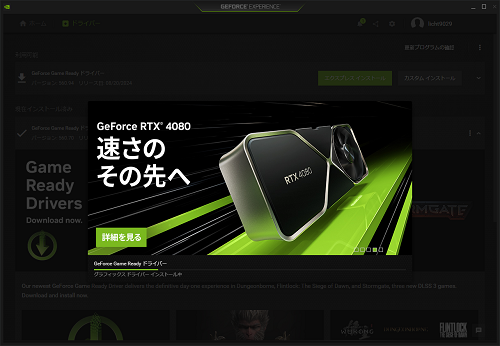
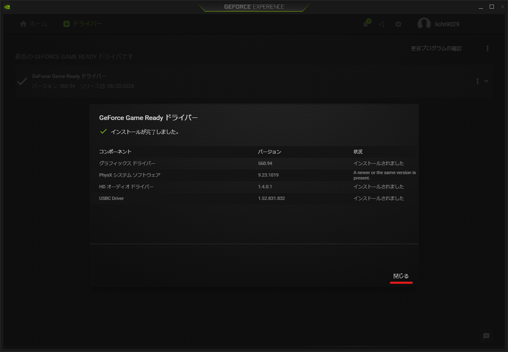
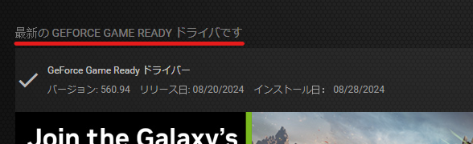

# エラー：NVENCコーデックを開けませんでした

このページでは、エラー「NVENCコーデックを開けませんでした」の解決方法について解説します。

:::info このページについて

- **ページ更新時期** : このページは**2024年8月**に執筆しています。現状と内容が異なる場合があります。
- **OBS Studioのバージョン** : このページは**OBS Studio 30.2.3 64bit**の情報が記載されています。
:::

  	
エラーメッセージのテキスト

	>配信開始に失敗しました
	>
	>NVENCコーデックを開けませんでした: Function not implemented  
	>お使いのビデオドライバが最新のものであるかを確認してください。

***

## 対処方法

:::note 
ステップを上から順番に対応します。  
改善が見込めなかった場合に次のステップへ進んでください。
:::

### ステップ①：配信設定の確認

[**「配信設定：公式推奨の設定」**](/docs/obs_studio/recommended_setting/streaming.md)を参考にし、自分の意図した配信設定になっているか、確認してください。  
「**映像エンコーダ**」の設定が原因として考えられます。  
OBS Studioのアップデートなどで設定が初期化されていたりすることで、意図した設定になっていない場合があります。

問題が解決しない場合、次のステップに進みます。

### ステップ②：OBS Studioの再起動

OBS Studioの再起動を行います。  
再起動後、エラーが起こった操作と同じ操作を行ってください。  
問題が再発するか確認します。

問題が解決しない場合、次のステップに進みます。

### ステップ③：最新ドライバーのインストール

「**GeForce Experience**」もしくは[**NVIDIA公式サイト**](https://www.nvidia.com/ja-jp/drivers/)からドライバーをダウンロード、インストールを行います。

この項目では「GeForce Experience」を使用した最新ドライバーのインストール方法を解説します。

  	
NVIDIA公式サイトからインストールを行う場合

	以下のような入力欄に、自分の使用しているグラフィックボードの型番を入力して検索する必要があります。  
	ドライバーは都度新しいバージョンがリリースされるため、毎回入力する手間がないように「GeForce Experience」を導入することをお勧めします。
	  

	「GeForce Experience」は[**公式のダウンロードページ**](https://www.nvidia.com/ja-jp/geforce/geforce-experience/download/)からダウンロード、インストールを行えます。

|画像|説明|
|:---:|---|
||まず、OBS Studioを閉じます。  閉じたら「**GeForce Experience**」を起動します。|
||windowsメニューを起動し「geforce」と入力します。  インストールされていると「**GeForce Experience**」がヒットするのでクリックします。    表示されない場合はインストールされていない可能性が高いです。  [**公式のダウンロードページ**](https://www.nvidia.com/ja-jp/geforce/geforce-experience/download/)からダウンロード、インストールします。|
||起動してログインが完了すると、左のような画面が表示されます。  画面左上の「**ドライバー**」をクリックします。|
||ドライバーの情報が表示されます。    最新のドライバーがインストールされていない場合、画面右上に「**ダウンロード**」という緑色のボタンが表示されているのでクリックします。    表示されていない場合、画面右上の「更新プログラムを確認」をクリックすると最新のドライバーが表示される場合があります。|
||ダウンロードが完了すると、ボタンが左画像のような表示になります。  「**エクスプレスインストール**」をクリックします。|
||インストールが開始されると左のような画面になります。  インストールが完了するまで待ちます。|
||インストールが完了すると、左の画像のような表示になります。  右下の「**閉じる**」を押して画面を閉じます。|
||正常に最新のドライバーがインストールされると、ドライバーページの左上の文字が「**最新のGEFORCE	 GAME READY ドライバです**」と表示されます。    これで最新ドライバーのインストールは完了です。  次のステップに進みます。|

### ステップ④：パソコンの再起動

ドライバのインストールが完了したらパソコンを再起動します。  
再起動が完了したらOBS Studioから配信を開始し、エラーが解決しているか確認してください。

エラーが解決しない場合、次のステップに進みます。

### ステップ⑤：同様の事例を探す

同じ事例での解決策を探します。  
このエラーだとかなりの数の記事がヒットするので、記事を参考にして解決を行ってみて下さい。

エラーが解決しない場合、次のステップに進みます。

### ステップ⑥：OBS Studioの再インストール

OBS Studioに問題がある場合が考えられます。  
一度OBS Studioをアンインストールし、再度インストールを行い、エラーが解決しているか確認してください。

エラーが解決しない場合、次のステップに進みます。

### ステップ⑦：コミュニティへ相談

OBS Studioのコミュニティで相談することをお勧めします。  
公式の「[**OBS Community**](https://discord.com/invite/obsproject)」というDiscordサーバーで質問すると迅速にレスポンスを返してもらえますが、言語が英語のためハードルが高いかもしれません。

著者が運営する「**Creator Hub**」の「[**OBS Studio質問チャンネル**](https://discord.com/channels/1263178523217236162/1263179354041749587)」にて質問をしていただければ、解決のお手伝いをします。  
公式のコミュニティにレスポンスの速さは劣りますが、日本語でサポートしますので、どうしても解決できない場合は頼ってください。  