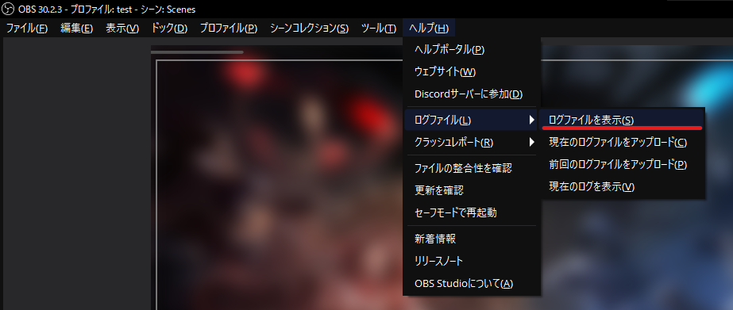
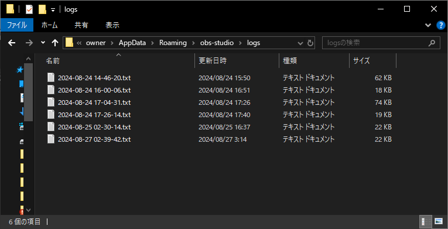

# ログファイルの確認方法

このページでは、ログファイルの確認方法について解説します。

:::info このページについて

- **ページ更新時期** : このページは**2024年8月**に執筆しています。現状と内容が異なる場合があります。
- **OBS Studioのバージョン** : このページは**OBS Studio 30.2.3 64bit**の情報が記載されています。
:::

***

## ログファイルとは？

ソフトウェアが動作中に何が起こったのか、情報を記録するファイルです。  
以下のような情報がログファイルには書かれています。

- **プログラムの実行状況**
- **エラー**
- **警告**

何の動作をしているときにどのようなエラーが起こっているかがわかるので、問題が発生したときの解決に役立ちます。

## 確認方法

|画像|説明|
|:---:|---|
||まずはOBS Studioを起動します。|
||画面上部のメニューから「ヘルプ」→「ログファイル」→「ログファイルを表示」をクリックします。|
||左の画像のようにエクスプローラーが表示されれば成功です。<br></br>ここに保存されているテキストファイルがログファイルです。|

## OBS Studioが起動できない場合

以下のフォルダパスにログファイルが保存されています。

```cmd title="Windows"
%appdata%\obs-studio\logs
```

コピーしてからエクスプローラーのアドレス欄に貼り付けてEnterキーを押してください。  
[**「ログファイルの確認方法」**](/docs/obs_studio/trouble_shooting/log_file#ログファイルの確認方法)で示したように、エクスプローラーでログファイルが確認できれば成功です。


## ログファイルの使い方

ログファイルを開いて内容を確認することで、何が原因で問題が起こったのかを理解しやすくなります。  
主な使い方として、問題解決のために**フォーラムやサポートチームにログファイルを送信**します。  
ログファイルが確認できると、サポート側が問題を把握しやすくなります。  
内容を読んで理解できる方は自力で解決まで比較的容易です。
