# ぼかし

ぼかしフィルターは、画像の一部や全体をぼかして、柔らかくしたり、動きの効果を作り出したりするフィルターです。  
背景をぼかして被写体を際立たせたり、動いているような印象を与えることができます。

フィルターの概要、メニューの場所については[**フィルターとは？**](/docs/photoshop/filter/what_is_filter.md)を確認してください。

:::info このページについて

- **バージョン** : このページは**Photoshop 2024**の情報が記載されています。
- **情報出展元** : [**公式のリファレンスページ**](https://helpx.adobe.com/photoshop/using/filter-effects-reference.html)を参考に記載しています。具体的な参照ページが存在する場合は適宜リンクを記載します。
:::

***

## ぼかし

画像全体、もしくは選択範囲内をぼかします。

|適用前|適用後|
|:---:|:---:|
|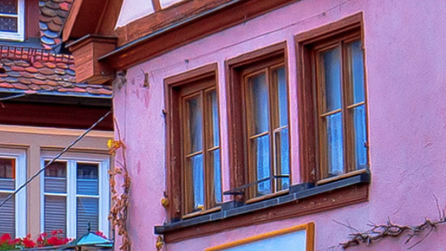|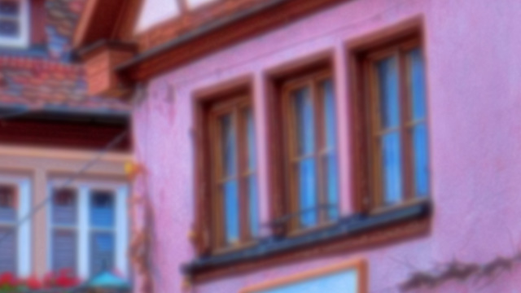|

  

    

		調整ができないのでほぼ使いません。
    

    

	

## ぼかし（ガウス）

画像のエッジが滑らかになり、**全体的にやわらかい印象**を与えることができます。  
特に、背景を自然にぼかしたいときや、写真全体を少しぼやけさせて優しい感じにしたいときに使います。  
メニューを選択すると以下のような画面が開くので、プレビューで確認しながら強さを設定します。  

  	
設定画面

	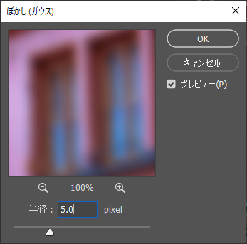

|適用前|適用後(半径:5.0px)|
|:---:|:---:|
|||

  

    

		結構便利なので、多用します。
    

    

  	

## ぼかし（シェイプ）

特定の形を使って画像をぼかすことができます。  
たとえば、星や円などの形を選択し、その形に沿ってぼかしをかけることができます。  
形を選んだら、スライダーでぼかしの強さを調整できます。  

  	
設定画面

	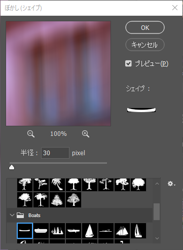

|適用前|適用後（半径:30px）|
|:---:|:---:|
|||

  

    

		制御が難しいです。  
		特定の状況でないと、あまり使わない印象です。
    

    

  

## ぼかし（ボックス）

均等にぼかし効果を適用するフィルターです。  
指定した範囲内で直線的にぼかしをかけるため、**四角いぼかし**がかかります。  
ぼかしの強さを調整するために、半径を設定できます。

  	
設定画面

	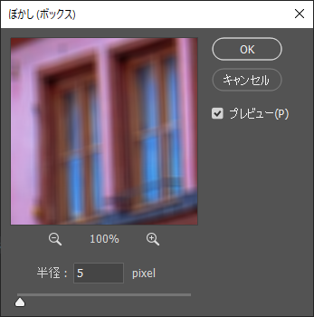

|適用前|適用後（半径:5px）|
|:---:|:---:|
|||

## ぼかし（レンズ）

カメラのレンズで撮影したときのように画像をぼかすことができます。  
レンズの前にある物体が**焦点から外れてぼやける感じ**を再現できます。  
背景をぼかしてフォーカスを合わせたい部分を目立たせることができます。  

  	
設定画面

	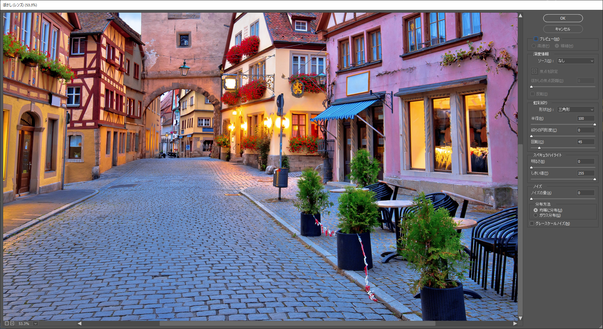

|適用前|適用後（半径:5px）|
|:---:|:---:|
|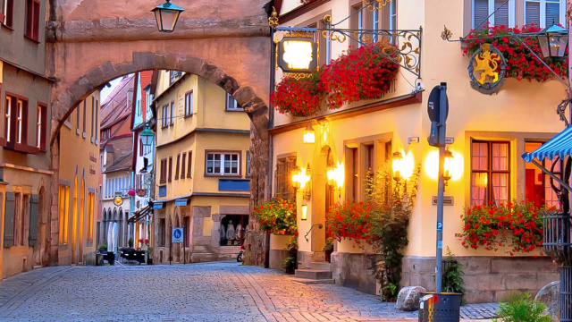|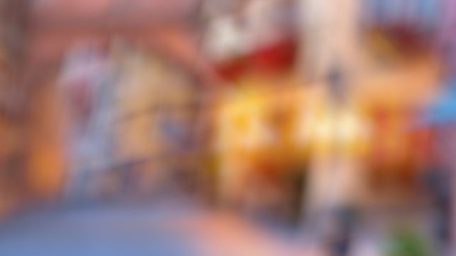|

「虹彩絞り」の「形状」を変更すると以下のようにボケの形が変わります。
|三角形|四角形|
|:---:|:---:|
||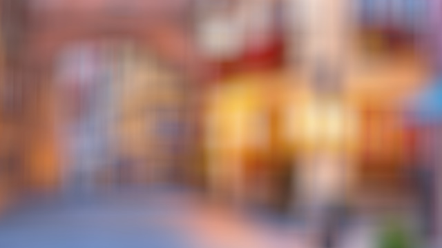|

  

    

      設定項目が、やや上級者向けです。  
      範囲選択・レイヤー単位でフィルターをかけることで、カメラでのボケを演出できます。 
      夜景など、ムードのある雰囲気づくりによく使います。  
      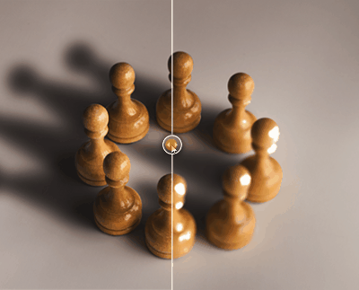 
      引用:[Sharpening recommendations](https://helpx.adobe.com/photoshop/using/adjusting-image-sharpness-blur.html)
    

    

  

## ぼかし（移動）

動かしたときにできるようなボケを作るフィルターです。  
例えば、写真の全体、または一部が**速く動いているように見せたいとき**に使います。  
「角度」で方向を、「距離」で強さを設定します。  

  	
設定画面

	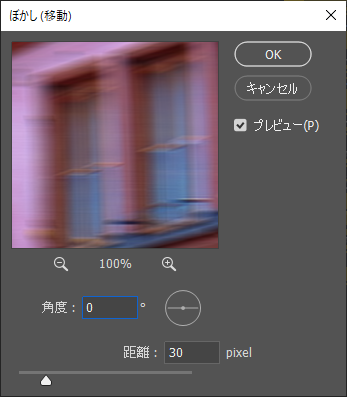

|適用前|適用後（角度:0゜, 距離:30px）|
|:---:|:---:|
|||

角度を変更すると、以下のようにボケの伸びる方向が変わります。

|角度:0゜|角度:90゜|
|:---:|:---:|
|||

	

		

		ブレや速度のあるような演出を簡単に作れます。 部分的に多用します。
		

		

	

## ぼかし（強）

画像全体、もしくは選択範囲内を強くぼかします。

|適用前|適用後|
|:---:|:---:|
||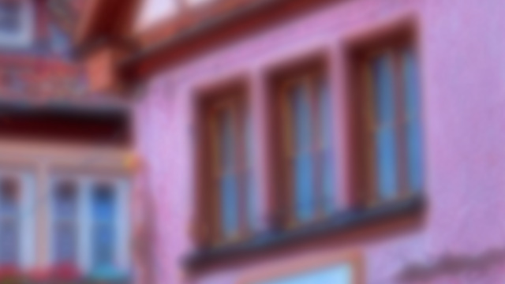|

以下は「ぼかし」と「ぼかし（強）」のフィルターを100回かけた時の比較です。
「ぼかし（強）」のほうが強めにボケがかかっていることが分かります。

|ぼかし|ぼかし（強）|
|:---:|:---:|
|||

	

		

		「ぼかし」同様、ほぼ使いません。
		

		

	

## ぼかし（詳細）

ぼかしの強さのほかに、しきい値、画質を指定できます。  
「しきい値」によって、色がどれくらい異なっていてもぼかす対象にするかを設定できます。  
また「モード」から「エッジのみ」や「エッジのオーバーレイ」を使用することで、色の境目にラインを描画することができます。

  	
設定画面

	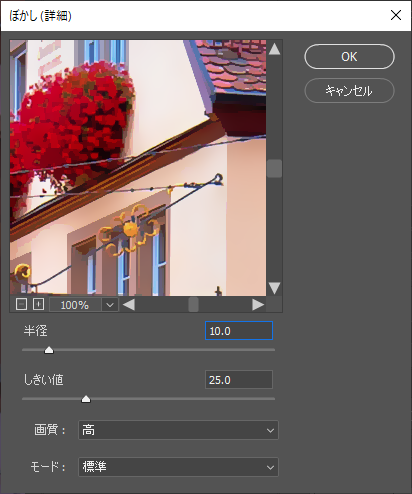

|適用前|適用後（半径:10.0, しきい値:25.0）|
|:---:|:---:|
|||

「モード」を変更すると以下のような表現ができます。

|エッジのみ（半径:10.0, しきい値:80.0）|エッジのオーバーレイ（半径:10.0, しきい値:80.0）|
|:---:|:---:|
|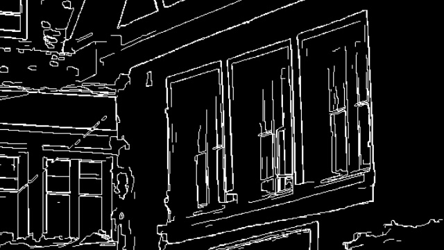|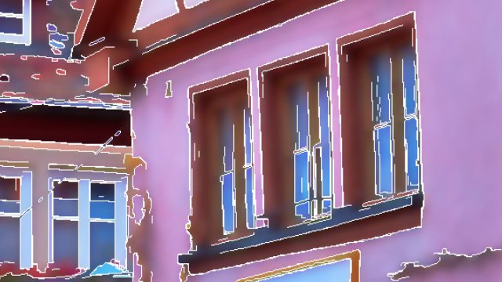|

	

		

		写真からアニメ風の画像を作る時など、表面の情報を落としたいときに主に使っています。    
		画質設定を高くすると丁寧にボケを計算するため、フィルターの計算に時間がかかります。  
		ご注意ください。
		

		

	

## ぼかし（表面）

色の境目をつぶさないように画像をぼかします。  
ノイズやざらつき感を除去するときに役に立ちます。  
「しきい値」によって、色がどれくらい異なっていてもぼかす対象にするかを設定できます。  

  	
設定画面

	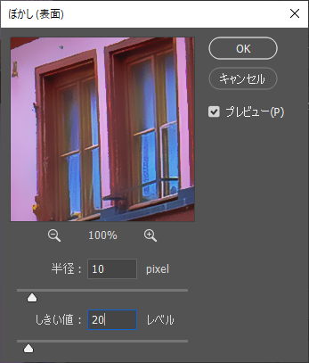

|適用前|適用後（半径:10.0, しきい値:20.0）|
|:---:|:---:|
|||

	

		

		写真からアニメ風の画像を作る時など、表面の情報を落としたいときに主に使っています。    
		エッジの表現や、画質を気にしないのであれば、「ぼかし（詳細）」ではなく、こちらを使っても問題ありません。  
		処理もこちらの方が断然早いです。
		

		

	

## ぼかし（放射状）

カメラのズームまたは回転しているように画像をぼかします。  
円状にぼかすには、「回転」を、拡大・縮小しているかのようにぼかすには、「ズーム」を選択します。

  	
設定画面

	

|適用前|適用後（量:10, 方法:回転）|
|:---:|:---:|
||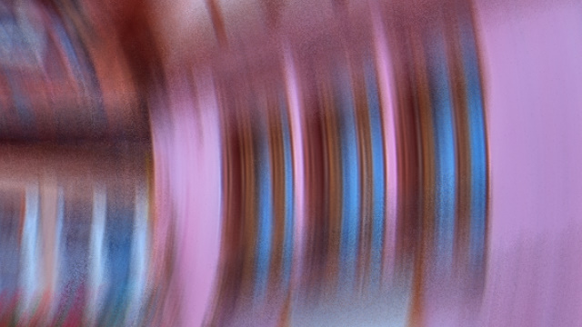|

|回転（量:10）|ズーム（量:30）|
|:---:|:---:|
|||

	

		

		かなり特徴的なブレ表現を加えることができます。  
		場面は限定されますが、ぼかしの中では使用頻度で上位にきます。
		

		

	

## 平均

画像全体または選択範囲を平均的な色で塗りつぶします。  
例えば、ほとんどの色が緑色の草を選択して適用すると、全体が一色の緑に変わります。

|適用前|適用後（選択範囲を指定）|
|:---:|:---:|
||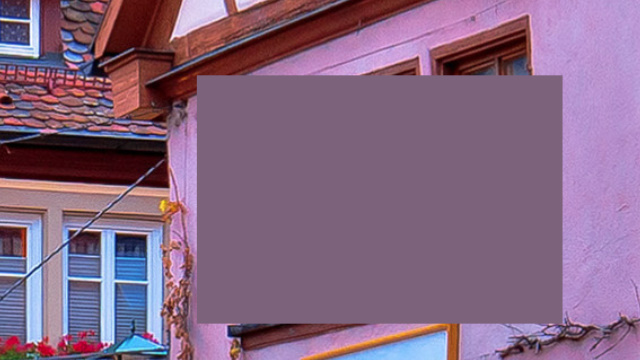|

	

		

		ほぼ使いません。  
		一律で塗りたい場合は「塗りつぶし」を使いますし、  
		このぼかしを使うことは極めて限定的だと思います。
		

		

	

