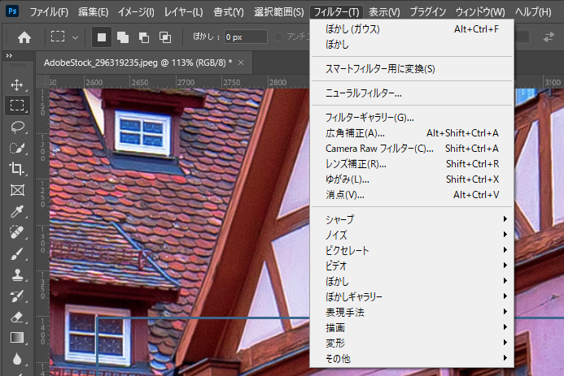

# フィルターとは？

このページでは、フィルターについて解説します。  

フィルターは、写真や画像に特殊な効果を加えるためのツールです。  
ぼかしたり、鮮やかにしたり、絵のような見た目にすることが簡単にできます。  
これを使うと、写真の印象を大きく変えることができます。  

:::info このページについて

- **バージョン** : このページは**Photoshop 2024**の情報が記載されています。
:::

***

## メニューの場所

画面上部のメニューバーから「**フィルター**」をクリックすると表示されます。  

## ページリンク

- [ぼかし](bokeh/bokeh.md)
